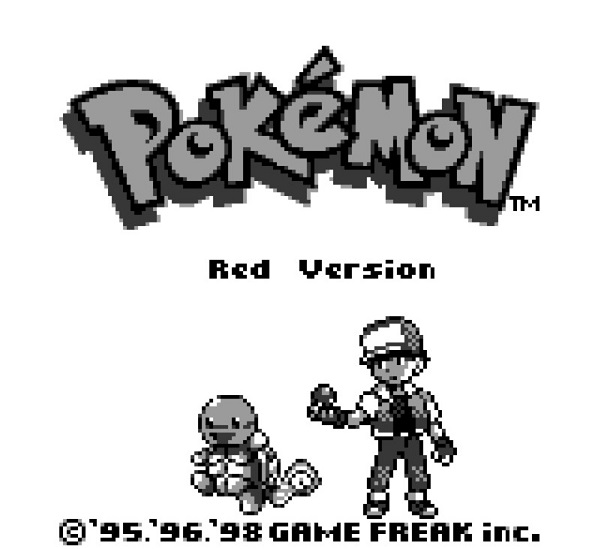
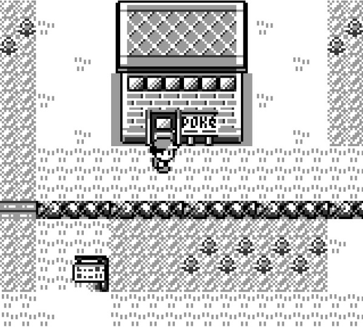
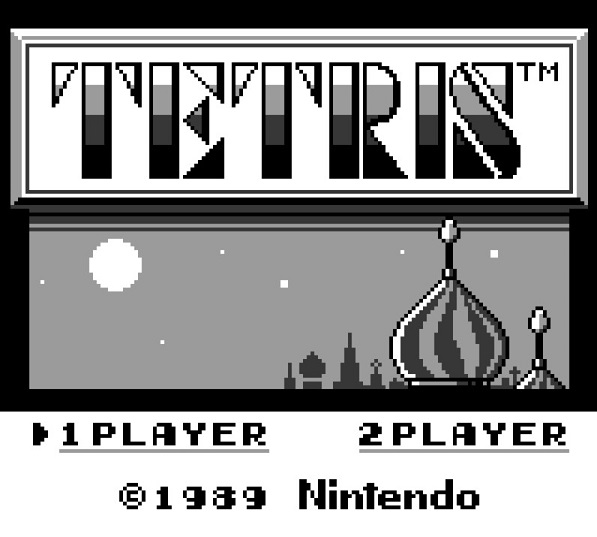
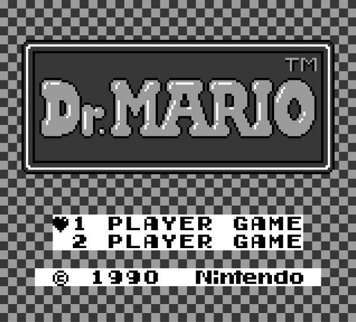
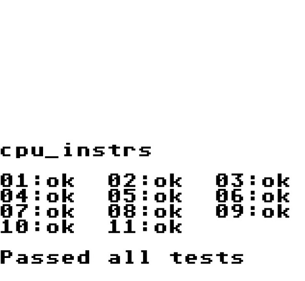

# GBSdl
`GBSdl` is Nintendo GameBoy emulator app for Windows/Linux/MacOS. It implements an SDL graphics layer on top of [GBLib](https://github.com/David-Parker/GBLib).

## How to Build
Clone the repository and initialize submodule dependencies.
`git clone --recurse-submodules https://github.com/David-Parker/GBSdl.git`

In the root directory run cmake.
`cmake .`

CMake will generate platform specific build tools, e.g. a `Makefile` on Linux.

All source and header files reside in the `src` folder.

## License
`GBSdl` is released under the MIT license.
# GBSdl
`GBSdl` is Nintendo GameBoy emulator app for Windows/Linux/MacOS. It implements an SDL graphics layer on top of [GBLib](https://github.com/David-Parker/GBLib).

## How to Build
Clone the repository and initialize submodule dependencies.
`git clone --recurse-submodules https://github.com/David-Parker/GBSdl.git`

In the root directory run cmake.
`cmake .`

CMake will generate platform specific build tools, e.g. a `Makefile` on Linux.

All source and header files reside in the `src` folder.

## License
`GBSdl` is released under the MIT license.

## Running
The app launches a console window where you may enter a path to the ROM file. This path can also be passed as the first command line argument.
## Media

## Running
The app launches a console window where you may enter a path to the ROM file. This path can also be passed as the first command line argument.